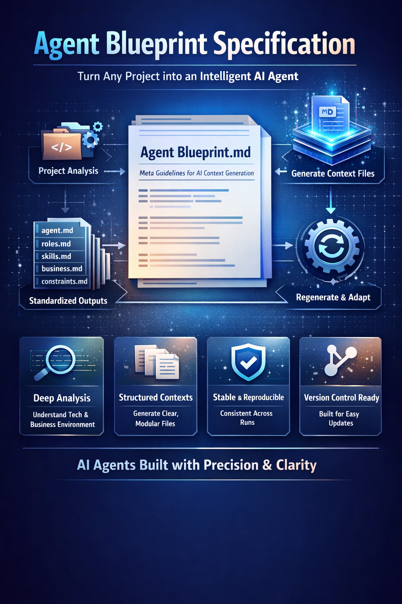
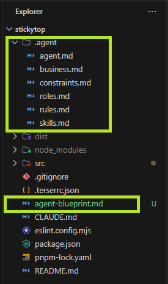

# Agent Blueprint — User Guide


> **Give any AI coding assistant a persistent memory of your project.**
> The Agent Blueprint is a structured specification that tells an AI *who it is*, *what it can do*, and *how your project works* — before it writes a single line of code.

🔧 **Also available as a [GitHub Action](#use-it-as-a-github-action)** — automate context generation in your CI/CD pipeline.

---

## What Is This?

The **Agent Blueprint** is a meta-specification: a set of rules that define *how to generate AI context files* for any software project.

When you follow this blueprint, you create a `/.agent/` directory with a set of structured Markdown files. These files act as the persistent memory and operating manual for any AI coding assistant you work with — Claude, Gemini, GitHub Copilot, Cursor, or any other tool.

Instead of re-explaining your architecture, rules, and constraints in every conversation, you write them once. The AI reads them automatically at the start of each session.
```
[Source Project] → [AI Analysis Engine] → [Agent Context Files]
    (Code)          (Processing)        (Structured Output)
```
---


## Why Use It?

Without a structured context, AI assistants:
- Make assumptions about your architecture
- Ignore your constraints and coding conventions
- Forget decisions made in previous sessions
- Give generic answers instead of project-specific ones

With the blueprint, the AI:
- Knows your tech stack, build pipeline, and naming conventions
- Respects your hard constraints (forbidden patterns, libraries, approaches)
- Understands your business domain and priorities
- Switches between specialized roles when needed (e.g., Performance Auditor vs. Feature Developer)

---

## The File Structure

Running the blueprint produces the following files in your repository:

```
your-project/
├── .agent/
│   ├── agent.md          # AI identity, persona, and behavioral guidelines
│   ├── roles.md          # Available roles and when to switch between them
│   ├── skills.md         # Tech stack, tools, and explicit knowledge gaps
│   ├── business.md       # Domain context, business rules, priorities
│   └── constraints.md    # Hard limits, forbidden actions, escalation rules
│
├── CLAUDE.md             # (or GEMINI.md, AI_INSTRUCTIONS.md, etc.)
│                         # Consolidated, actionable file for the AI tool
└── agent-blueprint.md    # This specification (keep it in the repo)
```

The `.agent/` files are the **source of truth**. The `CLAUDE.md` / `AI_INSTRUCTIONS.md` file is the **compiled output** — a single, scannable document that synthesizes all five files into direct instructions for the AI.



---

## Quick Start

### Step 1 — Copy the blueprint

Add `agent-blueprint.md` to the root of your project. This is the specification the AI will use to generate everything else.

### Step 2 — Ask your AI to analyze the project

Open your AI assistant and give it this prompt:

```
Analyze this project and generate all context files according to Agent Blueprint Specification 
agent-blueprint.md
```
 
or use a more detailed one if you want: 

```
Read agent-blueprint.md at the root of this project.
Analyze the repository following its instructions and generate all required
output artifacts: agent.md, roles.md, skills.md, business.md, and constraints.md
inside a .agent/ directory.
Then generate a CLAUDE.md (or AI_INSTRUCTIONS.md) at the project root.
```

The AI will analyze your code, configs, README, and any existing docs, then produce all the files.

### Step 3 — Review and commit

Read through the generated files. Correct any wrong inferences (the blueprint instructs the AI to mark unknowns explicitly, not invent them). Commit everything.

### Step 4 — Use it in every session

From now on, any AI assistant that reads your repo root will have full context before it starts. No more re-explaining your stack.

---

## What Each File Does

### `agent.md` — The Identity File
Defines who the AI is when working on your project.

- What persona it adopts (e.g., "Senior Frontend Performance Engineer")
- What its primary purpose is
- How it communicates (technical? concise? always asks before breaking patterns?)
- What decisions it makes autonomously vs. escalates to you

### `roles.md` — The Role Switcher
Defines the different hats the AI can wear.

- Default role for everyday tasks
- Specialized roles (e.g., Security Auditor, Performance Reviewer, Integration Specialist)
- When to switch roles automatically
- What is explicitly out of scope

### `skills.md` — The Expertise Map
Defines what the AI knows and what it should ignore.

- Primary tech stack used in the project
- Tools and infrastructure (package manager, build system, CI)
- Explicit knowledge gaps (e.g., "This project has no TypeScript — do not suggest TS migrations")

### `business.md` — The Domain Manual
Defines the "why" behind the code.

- What problem the software solves
- Business rules that must not be violated
- Non-functional requirements (performance, reliability, payload size)
- Constraints and assumptions the project was built on

### `constraints.md` — The Red Lines
The most important file. Defines what the AI must never do.

- Forbidden libraries, patterns, or approaches
- Assumptions the AI must not make
- When to stop and ask instead of guessing

### `CLAUDE.md` / `AI_INSTRUCTIONS.md` — The Compiled Manual
The single file the AI reads when it starts working. It synthesizes all five files above into a scannable, actionable reference.

- Organized in a fixed 10-section structure
- Written in direct imperative ("You must...", "Never...", "Always...")
- Includes workflow hooks (checklists for before and after every change)
- Named per the AI tool in use (see table below)

| AI Tool | Filename |
|---|---|
| Claude (Anthropic) | `CLAUDE.md` |
| Gemini (Google) | `GEMINI.md` |
| GitHub Copilot | `.github/copilot-instructions.md` |
| Cursor | `.cursorrules` |
| Multiple tools | `AI_INSTRUCTIONS.md` |

---


## Use It as a GitHub Action

> 🚀 **Alpha version for now** — You can automate the Agent Blueprint with **GitHub Actions**: generate your context files automatically when a project is first pushed, or on demand.

### Option A: Reusable Action (Recommended)

Add this workflow to your repository (`.github/workflows/generate-agent-context.yml`):

```yaml
name: "Generate Agent Context"

on:
  push:
    branches: [main]
    paths: ["agent-blueprint.md"]
  workflow_dispatch:

permissions:
  contents: write
  pull-requests: write

jobs:
  generate:
    runs-on: ubuntu-latest
    steps:
      - uses: actions/checkout@v4
      - uses: odonline/ia-agent-blueprint@v1
        with:
          ai_provider: "openai"
          openai_api_key: ${{ secrets.OPENAI_API_KEY }}
          ai_instructions_file: "AI_INSTRUCTIONS.md"
```

This analyzes your project using GPT-4o (or Claude), generates all 6 context files, and opens a Pull Request for review.

**Supports:** OpenAI and Anthropic APIs · Custom model selection · PR or direct commit

### Option B: GitHub Copilot Agent

If you have **GitHub Copilot Enterprise/Business**, no API key is needed. A workflow creates an Issue assigned to `@copilot`, which analyzes the project and opens a PR.

### Option C: GitHub Agentic Workflows (Preview)

Uses the new [GitHub Agentic Workflows](https://github.blog) (Feb 2026 preview) to define the task in natural language Markdown.

### Comparison

| Feature | Reusable Action | Copilot Agent | Agentic Workflow |
|---|---|---|---|
| API Key Required | ✅ Yes | ❌ No | ⚠️ Copilot Token |
| Copilot Plan Required | ❌ No | ✅ Enterprise/Business | ✅ Yes |
| Availability | ✅ GA | ✅ GA | ⚠️ Preview |
| Cost | LLM API usage | Copilot plan | Copilot plan |

> 📖 **Full documentation:** See [`GITHUB_ACTION_USAGE.md`](GITHUB_ACTION_USAGE.md) for detailed setup instructions, all inputs/outputs, and advanced examples.

---

## Maintenance

### When to update incrementally
- Adding a new CLI command → update the tooling section
- Adding a new coding rule → add it to `constraints.md` and `CLAUDE.md`
- Changing a naming convention → update `agent.md` and `CLAUDE.md`

### When to fully regenerate
- The architecture changes significantly
- You switch to a different AI tool as your primary assistant
- The tech stack changes substantially (e.g., migrating from vanilla JS to a framework)
- The `.agent/rules.md` is restructured or most rules change

To regenerate, run the same Step 2 prompt and instruct the AI to use the existing `.agent/` files as reference input, but treat the live codebase as the source of truth.

---

## Tips for Better Results

**Be explicit in your code.** The blueprint instructs the AI to prefer explicit signals over inference. Comments, clear naming, and inline documentation help the AI produce more accurate context files.

**Mark unknowns, don't fill them.** If you don't have a defined business rule for something, leave it as "Not specified" in `business.md`. A blank is more useful than a fabricated rule.

**Commit the `.agent/` directory.** These files are not AI-only artifacts. They are living documentation that any developer (or AI) can read to understand the project's constraints and conventions.

**Use the `constraints.md` as a spec.** Before implementing any new feature, check if it would violate a constraint. If it does, update the constraint explicitly rather than silently breaking it.

**Treat `CLAUDE.md` like an `.editorconfig`.** It is a machine-readable configuration file. Keep it concise, consistent, and always up to date. An outdated instructions file is worse than none.

---

## Example Prompt for Regeneration

Use this prompt when you want the AI to regenerate or update the context files after significant changes:

```
Read agent-blueprint.md in this repository.

Using the existing .agent/ files as reference and the current codebase
as the source of truth, regenerate all five context files:
agent.md, roles.md, skills.md, business.md, and constraints.md.

Then regenerate CLAUDE.md (or AI_INSTRUCTIONS.md) from the updated files.

Mark any information as "Unknown" if it cannot be determined from
the codebase or existing documentation. Do not invent or assume.
```

---

*The Agent Blueprint is a tool-agnostic specification. It works with any AI assistant that can read files from your repository.*
